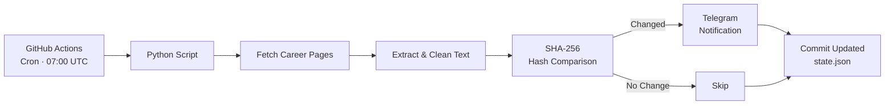

# JobWatch

Automatically monitors company career pages daily and sends you a Telegram notification whenever something changes — powered entirely by GitHub Actions, no server required.

## Features

- **Daily automated checks** via GitHub Actions cron schedule
- **Change detection** using SHA-256 content hashing
- **Telegram notifications** with a clean summary of all changes
- **Zero infrastructure** — runs entirely on GitHub Actions
- **Fault-tolerant** — one failing URL won't break the entire run
- **Easy configuration** — just edit `config.yaml` to add companies

## Architecture



## Setup

### 1. Fork or clone this repository

```bash
git clone https://github.com/your-username/JobWatch.git
cd JobWatch
```

### 2. Create a Telegram Bot

1. Open Telegram and search for [@BotFather](https://t.me/BotFather)
2. Send `/newbot` and follow the instructions
3. Copy the **Bot Token** you receive
4. Send a message to your new bot, then visit:
   ```
   https://api.telegram.org/bot<YOUR_TOKEN>/getUpdates
   ```
   Find your `chat_id` in the response JSON.

### 3. Configure GitHub Secrets

Go to your repository **Settings > Secrets and variables > Actions** and add:

| Secret               | Value                  |
| -------------------- | ---------------------- |
| `TELEGRAM_BOT_TOKEN` | Your bot token         |
| `TELEGRAM_CHAT_ID`   | Your chat ID           |

### 4. Edit the watchlist

Open `config.yaml` and add the companies you want to monitor:

```yaml
companies:
  - name: "SAP"
    url: "https://jobs.sap.com/search/?q=IT"
    keywords:
      - "Informatik"
      - "Business Analyst"

  - name: "Siemens"
    url: "https://jobs.siemens.com/careers?query=IT"
    keywords:
      - "Digital"

  - name: "Beispiel GmbH"
    url: "https://beispiel.de/karriere"
    # No keywords = report any change
```

### 5. Push and go

```bash
git push origin main
```

The GitHub Action runs automatically every day at 07:00 UTC. You can also trigger it manually from the **Actions** tab using `workflow_dispatch`.

## Local Development

```bash
# Create a virtual environment
python -m venv .venv
source .venv/bin/activate

# Install dependencies
pip install -r requirements.txt

# Set environment variables
export TELEGRAM_BOT_TOKEN="your-token"
export TELEGRAM_CHAT_ID="your-chat-id"

# Run
python -m src.main
```

## Tech Stack

- **Python 3.12** — core runtime
- **GitHub Actions** — scheduling and CI/CD
- **Telegram Bot API** — notifications
- **BeautifulSoup4** — HTML parsing and text extraction
- **requests** — HTTP client
- **PyYAML** — configuration

## License

[MIT](LICENSE)
