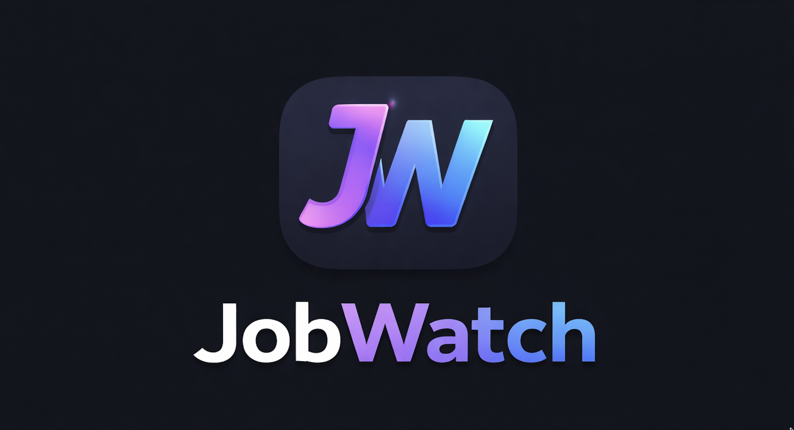
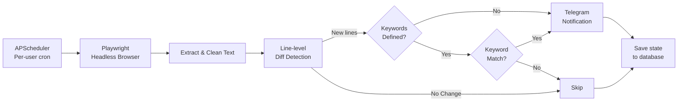

  

<h1 align="center">JobWatch</h1>

  An interactive Telegram bot that monitors company career pages and notifies you about new job postings.

  <a href="https://t.me/JobWatchTelegramBot">@JobWatchTelegramBot</a>

## Features

- **Interactive Telegram bot** with inline keyboard buttons
- **Per-user scheduling** — each user sets their own notification time
- **Change detection** using line-level diffing across career pages
- **Keyword filtering** — only get notified when relevant terms appear
- **Multi-user support** — multiple users can track different companies independently
- **Encrypted storage** — SQLCipher (AES-256 encrypted SQLite)
- **Headless scraping** — Playwright for JavaScript-heavy career pages

## How It Works

## Bot Commands

| Command | Description |
|---------|-------------|
| `/start` | Initialize your account |
| `/add` | Add a company to watch |
| `/remove` | Remove a company |
| `/list` | Show all tracked companies |
| `/check` | Run an immediate check |
| `/time HH:MM` | Set daily notification time (UTC) |
| `/pause` | Pause tracking for a company |
| `/resume` | Resume a paused company |
| `/keywords` | Change keyword filters |
| `/help` | Show help with inline buttons |

## Tech Stack

- **Python 3.12**
- **Playwright** — headless browser for JS-rendered pages
- **python-telegram-bot** — Telegram Bot API
- **APScheduler** — per-user cron scheduling
- **SQLCipher** — encrypted database

## License

[MIT](LICENSE)
