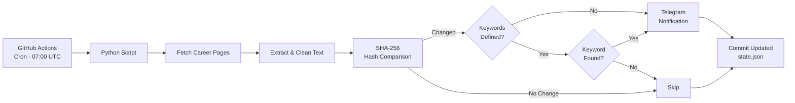

# JobWatch

Automatically monitors company career pages daily and sends you a Telegram notification whenever something changes — powered entirely by GitHub Actions, no server required.

## Features

- **Daily automated checks** via GitHub Actions cron schedule
- **Change detection** using SHA-256 content hashing
- **Keyword filtering** — only get notified when relevant terms appear (e.g. "Werkstudent", "Working Student")
- **Telegram notifications** with a clean summary of all changes
- **Zero infrastructure** — runs entirely on GitHub Actions
- **Fault-tolerant** — one failing URL won't break the entire run
- **Easy configuration** — just edit `config.yaml` to add companies

## Architecture



## Setup

### 1. Fork this repository

Click the **Fork** button at the top right of this page to create your own copy.

Then clone your fork:

```bash
git clone https://github.com/<your-username>/JobWatch.git
cd JobWatch
```

### 2. Create a Telegram Bot

1. Open Telegram and search for [@BotFather](https://t.me/BotFather)
2. Send `/newbot` and follow the instructions
3. Copy the **Bot Token** you receive
4. Send any message to your new bot (e.g. "hello")
5. Open this URL in your browser (replace `<YOUR_TOKEN>` with your actual token):
   ```
   https://api.telegram.org/bot<YOUR_TOKEN>/getUpdates
   ```
6. Look for `"chat":{"id":123456789}` in the response — that number is your **Chat ID**

### 3. Configure GitHub Secrets

Go to your forked repository on GitHub: **Settings > Secrets and variables > Actions > New repository secret**

Add these two secrets:

| Secret               | Value                          |
| -------------------- | ------------------------------ |
| `TELEGRAM_BOT_TOKEN` | The token from BotFather       |
| `TELEGRAM_CHAT_ID`   | Your chat ID from step 2       |

### 4. Edit the watchlist

Open `config.yaml` and add the companies you want to monitor:

```yaml
companies:
  - name: "SAP"
    url: "https://jobs.sap.com/go/SAP-Jobs-in-Berlin/912401/"
    keywords:
      - "Werkstudent"
      - "Working Student"

  - name: "Cherry Ventures"
    url: "https://talent.cherry.vc/jobs?titlePrefix=working&locations=Berlin"
    # No keywords = report any change
```

**How keywords work:**
- **With keywords:** A change is only reported if at least one keyword appears on the page (case-insensitive, partial match — e.g. "Werkstudent" also matches "Werkstudentin" or "werkstudenten")
- **Without keywords:** Any change to the page is reported

**Tip:** Use a broad career page URL (e.g. all jobs in Berlin) and let keywords filter for the roles you care about.

### 5. Push and go

```bash
git add config.yaml
git commit -m "Update watchlist"
git push
```

The GitHub Action runs automatically every day at 07:00 UTC. You can also trigger it manually: **Actions > JobWatch > Run workflow**.

> **Note:** The first run stores a baseline hash for each page and does not send any notification. Starting from the second run, you'll be notified whenever a page changes.

## Local Development

```bash
python -m venv .venv
source .venv/bin/activate
pip install -r requirements.txt

export TELEGRAM_BOT_TOKEN="your-token"
export TELEGRAM_CHAT_ID="your-chat-id"

python -m src.main
```

## Tech Stack

- **Python 3.12** — core runtime
- **GitHub Actions** — scheduling and CI/CD
- **Telegram Bot API** — notifications
- **BeautifulSoup4** — HTML parsing and text extraction
- **requests** — HTTP client
- **PyYAML** — configuration

## License

[MIT](LICENSE)
